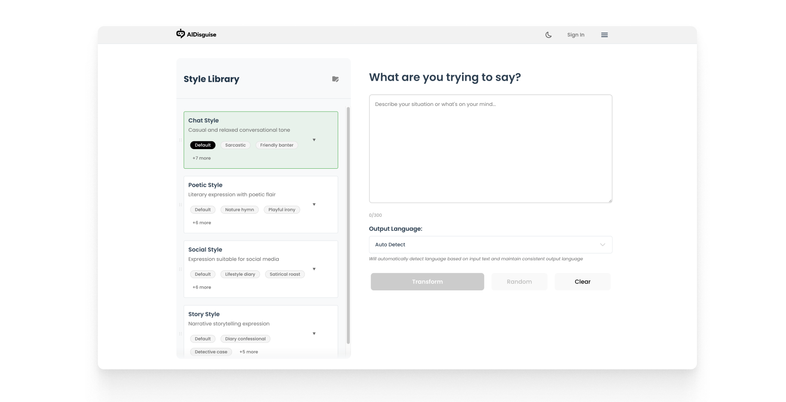
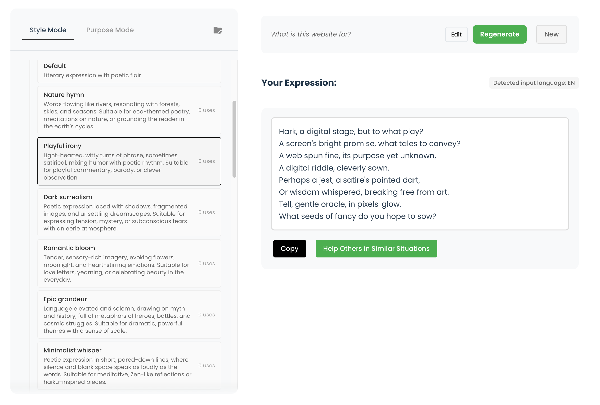
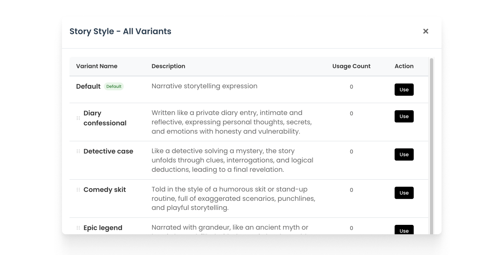
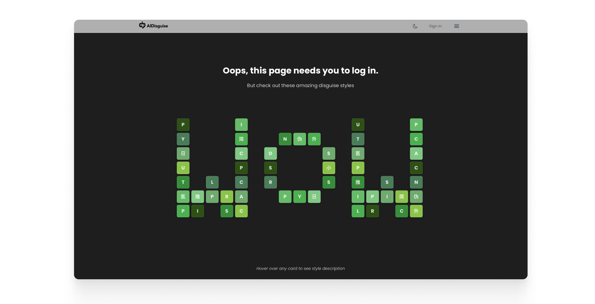

# AI Disguise

### Transform your words into any style in seconds

**[Try AI Disguise →](https://ai-disguise.vercel.app)**

> Transform your text with AI powered style and tone adjustments.

## What is AI Disguise?

AI Disguise is your personal communication assistant. Whether you need to explain something clearly, write a quick message, or handle an awkward moment, just open AI Disguise and find the right words.


## Screenshots






## Features

### Web App

####  Style Transformation
Transform your text into different writing styles (Chat, Poetry, Social, Story) or tailor it based on purpose and audience.

####  Personal Library
Save custom writing styles, templates, and frequently used phrases. Build your personal communication toolkit.

####  Community Sharing
Browse and share responses with the community. Discover new ways to express yourself.

####  Flexible API Options
- **Free mode**: 20 conversions per day
- **Custom mode**: Use your own API key (Gemini, OpenAI, Claude, DeepSeek)
- No usage limits with your own key

####  Multi-language Support
 English, Chinese (中文), Japanese (日本語), German (Deutsch), Spanish (Español) with automatic language detection.

####  History & Management
Save and revisit your transformations with smart history management.

### Browser Extension (In Development)

####  Text Selection Transform
Select any text on any webpage and instantly transform it with your pre-selected style.

####  Floating Ball Interface
- Draggable floating ball in the corner
- One-click style switching
- Show/hide toggle for distraction-free browsing

####  Seamless Integration
- Works on all websites
- Syncs with your web account
- Uses the same AI models and custom styles

> **Note**: The browser extension is currently under development. The codebase uses a monorepo architecture with shared logic between web and extension for easier maintenance.

## Tech Stack

- **Frontend**: React + Vite + React Router DOM
- **Backend**: Vercel Serverless Functions
- **AI**: Multi-provider support (Gemini, OpenAI, Claude, DeepSeek)
- **Database**: Firebase (Auth, Firestore)

## Local Development

```bash
# Install dependencies
npm install

# Start development server
npm run dev
```

## Security

User API keys are Base64-encoded and stored securely with Firestore security rules. See [SECURITY.md](SECURITY.md) for details.

## License

MIT License 


