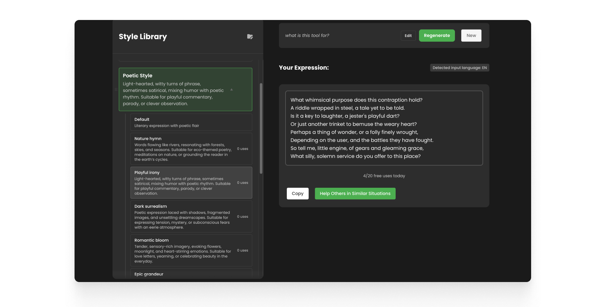

# AI Disguise

**[Try AI Disguise →](https://ai-disguise.vercel.app)** | **[Install Chrome Extension](#chrome-extension)**

> Transform your text with AI powered style and tone adjustments. Available as a web app and Chrome extension.

## What is AI Disguise?

AI Disguise is your personal communication assistant. Whether you need to explain something clearly, write a quick message, or handle an awkward moment, just open AI Disguise and find the right words.

## Platforms

-  **Web Application**: Full-featured web app at [ai-disguise.vercel.app](https://ai-disguise.vercel.app)
-  **Chrome Extension**: Quick access from your browser (coming soon)

## Screenshots





## Features

###  Style Transformation
Transform your text into different writing styles (Chat, Poetry, Social, Story) or tailor it based on purpose and audience.

###  Personal Library
Save custom writing styles, templates, and frequently used phrases. Build your personal communication toolkit.

###  Community Sharing
Browse and share responses with the community. Discover new ways to express yourself.

###  Flexible API Options
- **Free mode**: 20 conversions per day
- **Custom mode**: Use your own API key (Gemini, OpenAI, Claude, DeepSeek)
- No usage limits with your own key

###  Multi-language Support
 English, Chinese (中文), Japanese (日本語), German (Deutsch), Spanish (Español) with automatic language detection.

###  History & Management
Save and revisit your transformations with smart history management.

## Tech Stack

- **Frontend**: React + Vite + React Router DOM
- **Backend**: Vercel Serverless Functions
- **AI**: Multi-provider support (Gemini, OpenAI, Claude, DeepSeek)
- **Database**: Firebase (Auth, Firestore)

## Local Development

```bash
# Install dependencies
npm install

# Web app development
npm run dev:web

# Chrome extension development
npm run dev:extension
```

## Security

User API keys are Base64-encoded and stored securely with Firestore security rules. See [SECURITY.md](SECURITY.md) for details.

## License

MIT License 


